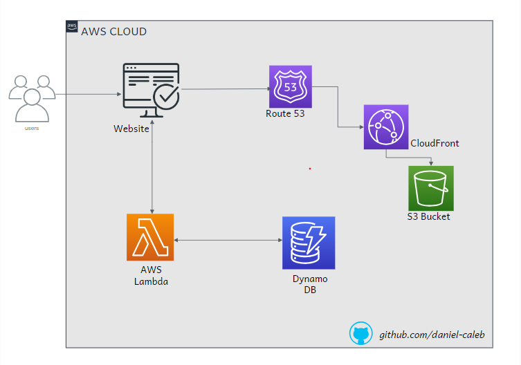
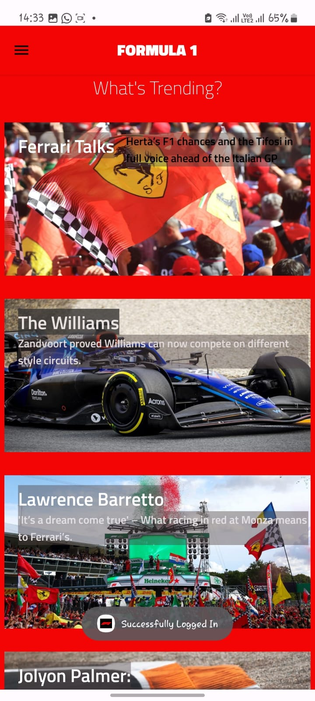

# 🚀 Projects Portfolio

Welcome to my curated list of selected projects, a blend of completed milestones and ongoing efforts that reflect my passion for technology, cloud computing, cybersecurity, and real-world problem solving.

---

## 🌩️ AWS Cloud Resume Challenge *(Completed)*

**Description:**  
The [AWS Cloud Resume Challenge](https://cloudresumechallenge.dev/docs/the-challenge/aws/) is a hands-on project designed to showcase cloud skills by building and deploying a resume website using various AWS services. The challenge involves creating a resume in HTML and CSS, hosting it as a static website on Amazon S3, securing it with HTTPS via CloudFront, and linking it to a custom domain. Additionally, it includes setting up a visitor counter using JavaScript, DynamoDB, and a serverless API with AWS Lambda and API Gateway. The project also emphasizes automation with Infrastructure as Code (IaC) tools like AWS SAM or Terraform, and continuous integration and deployment (CI/CD) via GitHub Actions. This challenge is a comprehensive way to demonstrate proficiency in cloud technologies and best practices in a real-world scenario

**Highlights:**  

- ***Quick File Upload***: Upload files to a specified S3 bucket with a single command.
- ***Target Directory Support***: Optionally specify a target directory within the S3 bucket.
- ***Error Handling***: Provides meaningful error messages for incorrect or missing inputs.
- ***Secure Handling of AWS Credentials***: Uses the AWS CLI for secure authentication and avoids hardcoding credentials.

**Tech Stack:**  
AWS S3, AWS Lambda, Dynamo DB, GitHub Actions

[Project Demo](http://resume.daniel.s3-website-us-west-2.amazonaws.com/) | [Blog](https://blog-daniel-caleb.hashnode.dev/my-cloud-resume-challenge-a-journey-from-zero-to-hero) | [GitHub Repository](https://github.com/daniel-caleb/My-Cloud-Resume.git)

---

## 🧵FileFrenzy CLI *(Completed)*

**Description:**  
A Bash-based command-line tool that allows users to securely and quickly upload files to AWS S3 buckets. Designed to provide a seamless experience similar to popular cloud storage platforms.

**Highlights:**  

- ***Quick File Upload***: Upload files to a specified S3 bucket with a single command.
- ***Target Directory Support***: Optionally specify a target directory within the S3 bucket.
- ***Error Handling***: Provides meaningful error messages for incorrect or missing inputs.
- ***Secure Handling of AWS Credentials***: Uses the AWS CLI for secure authentication and avoids hardcoding credentials.

**Tech Stack:**  
Bash, AWS S3, IAM

[GitHub Repository](https://github.com/daniel-caleb/FileFrenzy.git)

---

## 📱 F1 App (*Completed*)

**Description:**  
The Formula 1 Sport App is a modern and sleek Android application designed to provide users with the latest news, results, and standings of the current Formula 1 season, as well as historical data from past seasons. This project is built using Java and Kotlin in Android Studio.

**Highlights:**  
✅ ***News Feed*** - Displays articles and updates about the latest Formula 1 developments. (Currently hardcoded, with plans for API integration.)
✅ ***Drivers, Teams & Circuits*** - Showcases driver and teams, along with grand prix circuits.
✅ ***Modern UI*** - A user-friendly interface designed using Kotlin for seamless navigation.
✅ ***Race Schedule*** - Provides information on upcoming races, circuits, and teams.
✅ ***MVC Architecture*** - Follows the Model-View-Controller (MVC) architecture to separate concerns and maintain clean code.
✅ ***Hardcoded Data*** - For now, all information is pre-defined; API integration is planned for real-time updates.

**Tech Stack:**  
Java, Kotlin, Android Studio, MVC Architecture, XML Layout for UI Design

[GitHub Repository](https://github.com/daniel-caleb/Formula_1.git)

---

## 🔐 SpecterHawk - Threat Reporting Platform *(Ongoing)*🚧🚨

**Description:**  
A crowdsourced cyber threat intelligence reporting platform that allows individuals and organizations to report cyber incidents and view trends. Intended to enhance cyber awareness and early warnings, especially within Kenya and similar contexts.

**Highlights:**  

- User authentication and report submission dashboard  
- Real-time threat mapping and categorization  
- Admin panel for review and response coordination  
- Will feature an open API for analysts and researchers

**Tech Stack:**  
PHP (Laravel), MySQL, JavaScript, AWS (EC2, RDS), Bootstrap

*🚧(private/under development)*🚧🔨

---

## 🌾 ShambaSphere - Smart Farming Blog Platform *(Ongoing)*🚧🚨

**Description:**  
An agricultural knowledge-sharing and blog platform for Kenyan farmers, including paid content on best practices and a forum for peer advice. The project also explores monetization for agritech content creators.

**Highlights:**  

- Blog system with categorization and premium content  
- Secure payment integration for content access  
- AWS-hosted with domain-linked EC2 instance  
- Will integrate analytics to track user engagement

**Tech Stack:**  
PHP (Laravel), Vue.js, MySQL, AWS EC2, NGINX

🚧 *(in progress)*🚧🔨

---

💡 *More projects to be added as development continues...*
